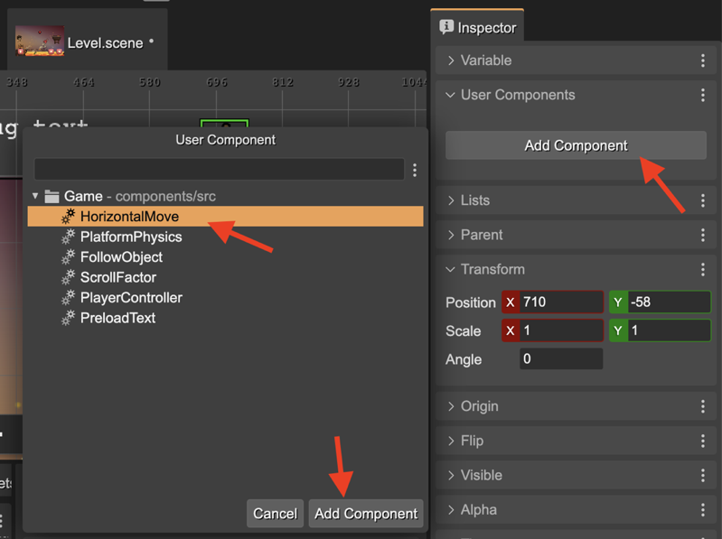
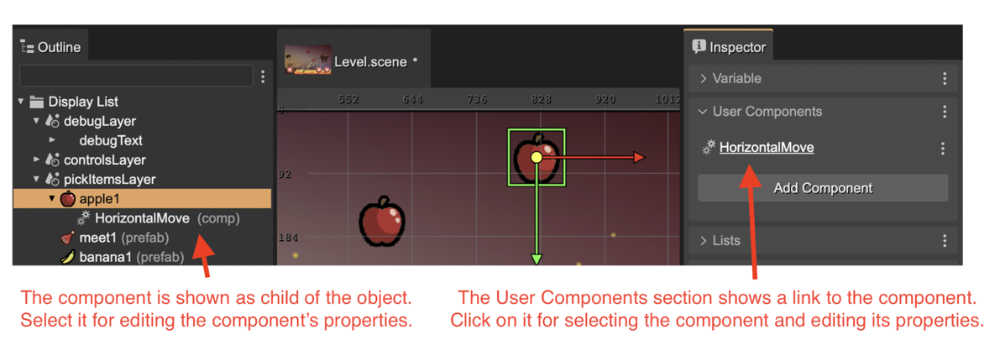
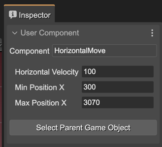
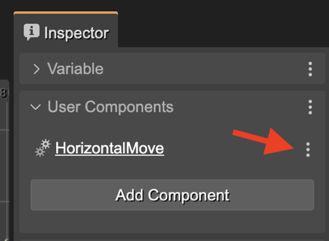
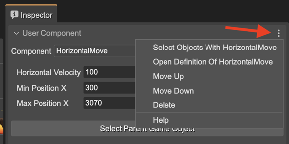

.. include:: ../_header.rst

Adding User Components to a Game Object
~~~~~~~~~~~~~~~~~~~~~~~~~~~~~~~~~~~~~~~

You can add a user component to an object (entity)  in two ways: manually, and with the |SceneEditor|_.

Adding a component to an object manually:

.. code::

    const platform = ...;
    const move = new HorizontalMove(platform);
    move.minX = 100;
    move.maxX = 400;

The constructor of the user component **HorizontalMove** adds the component to the object. You can keep a reference to the component or get the component from the game object, with the **getComponent** method:

.. code::

    const move = HorizontalMove.getComponent(platform);

However, the interesting is adding components to objects in the |SceneEditor|_.

This is possible in the **User Components** section. It shows the **Add Component** button.

When you click that button, it shows a dialog with all the components defined in the project (grouped by the ``*.components`` files). Select the one you want to add:

Then, the **HorizontalMove** component is shown as an object's child in the |OutlineView|_ and the User Components section shows a link to the component:

So, when you select the **HorizontalMove** component, the |InspectorView|_ shows the properties of the component:

The **Select Parent Game Object** button is a shortcut for selecting the object containing the component.

Generating the code for a component in an object
^^^^^^^^^^^^^^^^^^^^^^^^^^^^^^^^^^^^^^^^^^^^^^^^

The `user components compiler <user-components-compiler.html>`_ will generate the code to create the component, just like if you write it by hand:

.. code::

    // bridge2 (components)
    const bridge2HorizontalMove = new HorizontalMove(bridge2);
    bridge2HorizontalMove.horizVelocity = 100;
    bridge2HorizontalMove.minX = 10;
    bridge2HorizontalMove.maxX = 400;

Actions for a component
^^^^^^^^^^^^^^^^^^^^^^^

These are the actions associated to the user component of an object:

* **Select Objects With HorizontalMove**: selects in the scene all objects containing the **HorizontalMove** component.
* **Open Definition Of HorizontalMove**: opens the definition of the component in the `User Components Editor <./user-components-editor.html>`_.
* **Move Up**, **Move Down**: changes the order of the component.
* **Delete**: deletes the component from the object.

