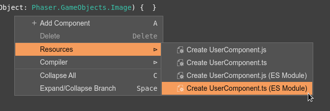

.. include:: ../_header.rst

A base class for your components
~~~~~~~~~~~~~~~~~~~~~~~~~~~~~~~~

In the previous section, we explored how you can implement behaviors by listening to Phaser events. There, we implemented an ``EventComponent`` base class for all the components. 

The components concept provided by |PhaserEditor|_ is flexible. However, we think it is a good idea to propose a way of implementing the components.

For this reason, we created a **UserComponent** class that you can use as the base class for all your components.

Following the philosophy or |PhaserEditor|_, the code of the **UserComponent** class is generated by the editor. You have the option of telling the editor to generate the **UserComponent** class and it will create a file and "write the code for you".

The procedure is simple, just open the context menu of the User Components Editor. In the **Resources** menu, there are options for creating the ``UserComponent.js`` files in different formats:



The options are:

* **Create UserComponent.js**: creates a ``UserComponent.js`` file with JavaScript code.
* **Create UserComponent.ts**: creates a ``UserComponent.ts`` file with TypeScript code.
* **Create UserComponent.js (ES Modules)**: creates a ``UserComponent.js`` file with a JavaScript file, using the ES module exporting rules.
* **Create UserComponent.ts (ES Module)**: creates a ``UserComponent.ts`` file with TypeScript code, using the ES module exporting rules.

If the file exists, the editor asks if you confirm replacing it.

You can do this operation just once unless you mess up the file content and want to reset it.

Once the file is created, you can use the **UserComponent** class as the super-class of your components.

Inside the UserComponent class
``````````````````````````````

In the `Implementing behaviors with the Phaser events <./user-components-start-update-methods.html>`_ section, we explain how a component can register listeners to the Phaser events, for implementing a particular behavior. The **UserComponent** class does the same. It listens for Phaser events and calls special methods that could be overridden in derived classes. These are the methods present by the **UserComponent** class:

.. code::

    class UserComponent {

        constructor(gameObject) {
            // registers the event listeners and call the methods
        }

        awake() { }

        start() { }

        update() { }

        destroy() { }
    }

It register the event listeners in the constructor:

.. code::

    constructor(gameObject) {

        this.scene = gameObject.scene;

        const listenAwake = 
                this.awake !== UserComponent.prototype.awake;
        const listenStart = 
                this.start !== UserComponent.prototype.start;
        const listenUpdate = 
                this.update !== UserComponent.prototype.update;
        const listenDestroy = 
                this.destroy !== UserComponent.prototype.destroy;
        
        if (listenAwake) {

            this.scene.events.once("scene-awake", this.awake, this);
        }

        if (listenStart) {

            this.scene.events.once(
                Phaser.Scenes.Events.UPDATE, this.start, this);
        }

        if (listenUpdate) {

            this.scene.events.on(
                Phaser.Scenes.Events.UPDATE, this.update, this);
        }

        if (listenStart || listenUpdate || listenDestroy) {

            gameObject.on(Phaser.GameObjects.Events.DESTROY, () => {

                this.scene.events.off(
                    Phaser.Scenes.Events.UPDATE, this.start, this);
                this.scene.events.off(
                    Phaser.Scenes.Events.UPDATE, this.update, this);

                if (listenDestroy) {

                    this.destroy();
                }
            });
        }
    }

But let's go step by step. First, it checks what events to listen to. Notice that the methods **awake()**, **start()**, etc..., are empty. So, if the component instance doesn't provide a different implementation for one of these methods, then it means it can skip calling that method. Then the first thing is to know what methods to call:

.. code::

        const listenAwake = 
            this.awake !== UserComponent.prototype.awake;

        const listenStart = 
            this.start !== UserComponent.prototype.start;

        const listenUpdate = 
            this.update !== UserComponent.prototype.update;

        const listenDestroy = 
            this.destroy !== UserComponent.prototype.destroy;

In the following lines, it adds the listeners to the Phaser events, but only if it is needed:

.. code::

    ...
    if (listenStart) {

        this.scene.events.once(Phaser.Scenes.Events.UPDATE, this.start, this);
    }

    if (listenUpdate) {

        this.scene.events.on(Phaser.Scenes.Events.UPDATE, this.update, this);
    }
    ...

At the end of the constructor, it registers a listener to the game object's destroy event and removes all the listeners. It does it to avoid calling a method if the object is not active.

When you create a new component, you can update it by just implementing the **update()** method:

.. code::

    class RotateObject extends UserComponent {

        constructor(gameObject) {
            super(gameObject);
        }

        ...

        update() {
            
            // this method is called when the scene
            // emits the UPDATE event

            this.gameObject.angle += 1;
        }
    }

The **UserComponent** class is "good enough" for many cases, but you can modify it or use a completely different one. Or use the Phaser events directly in your components. 
