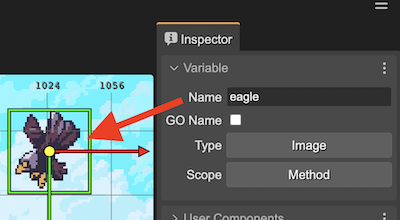
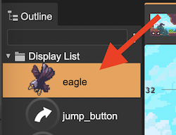
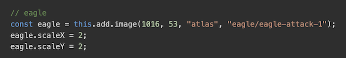
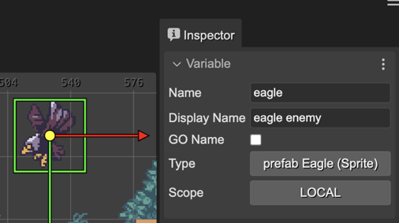
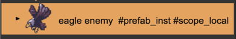
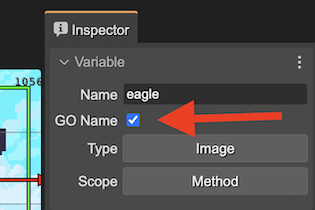
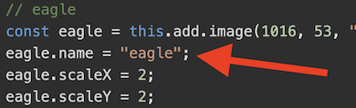
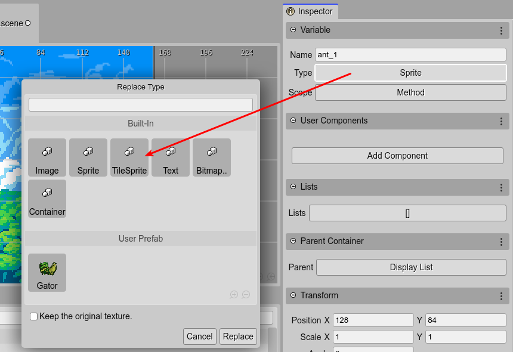

.. include:: ../_header.rst

Variable properties
~~~~~~~~~~~~~~~~~~~

The `variable properties`_ are introduced by the |SceneEditor|_ to be used by the |OutlineView|_ and the `scene compiler <scene-compiler.html>`_.

Name property
`````````````

This name is auto generated by the editor: 



It is used as the label in the |OutlineView|_:



And as a variable name in the generated code:



Display Name property
`````````````````````
You can change the default text of the game object in the |OutlineView|_ by setting the **Display Name** property. This display name is used only by the UI.





Game Object Name property
`````````````````````````

The **GO Name** property indicates if the previous **Name** property's value will be set as value to the `Game Object's name property <https://photonstorm.github.io/phaser3-docs/Phaser.GameObjects.GameObject.html#name>`_.

Check the **GO Name** property:



For generating the ``name`` value in code:



Type property
`````````````

This property shows the type of the selected object. In the case of prefabs_, it shows the name of the prefab and the Phaser_ type that is the root of the prefab. For example: ``prefab PlayButton (Image)``.

Also, you can click on the type name to change the type of the selected objects. It opens the `Replace Type dialog <./replace-object-type.html>`_:



Scope property
``````````````

The scope property refers to the lexical scope of the variable that references the object. The possible values are:

* ``LOCAL``: The variable is local to the creation of the object. It is optional, the compiler may generate it or not according if the object properties are modified.
* ``METHOD``: The variable is available in the method's scope.
* ``CLASS``: The variable is assigned to a private class field. The object is accessible from any other method of the class.
* ``PUBLIC``: Like the ``CLASS`` scope, but it is referenced by a public field. The object is accessible to any client of the class.
* ``NESTED_PREFAB``: Like ``PUBLIC``, but the object is also available as `nested prefab <./nested-prefab.html>`_ instance in the Scene Editor. It means, you can change its properties using the scene editor.

By default, the scope is set to ``LOCAL``. In previous versions of the editor, the default value was ``METHOD``, but now we are using ``METHOD`` to ensuring the |SceneCompiler|_ generates a variable for the object.