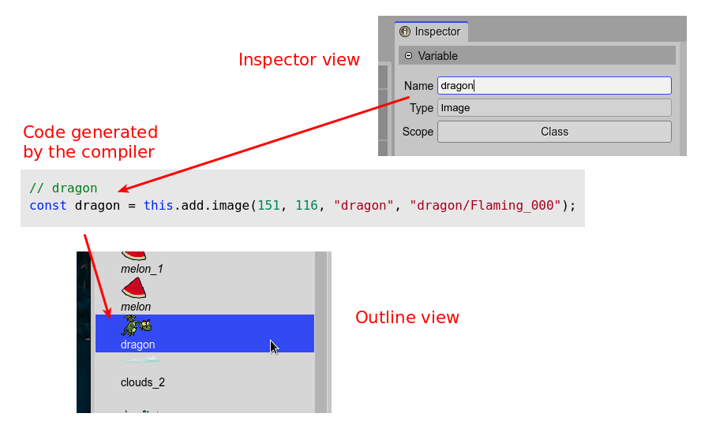

.. include:: ../_header.rst

Variable properties
~~~~~~~~~~~~~~~~~~~

The `variable properties`_ are introduced by the |SceneEditor|_ to be used by the |OutlineView|_ and the `scene compiler <scene-compiler.html>`_.

Name property
`````````````

Is the name of the variable generated to reference the object. When an object is created. This name is also used in the |OutlineView|_ as label of the object.

By default, this property gets the name of the file (like an image file) used to create the object. 



Type property
`````````````

This property is read only. It shows the type of the selected object. In case pr prefabs, it shows the name of the prefab and the Phaser_ type that is the root of the prefab. For example: ``prefab PlayButton (Image)``.

Scope property
``````````````

The scope property refers to the lexical scope of the variable that references the object. The possible values are:

* ``Class``: The variable is assigned to a private class field. The object is accessible from any other method of the class.

* ``Method``: The variable is local to the method.

* ``Public``: Like the ``Class`` scope, but it is referenced by a public field. The object is accessible to any client of the class.

By default, the scope is set to ``Method``.