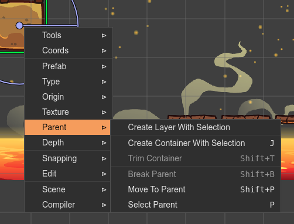
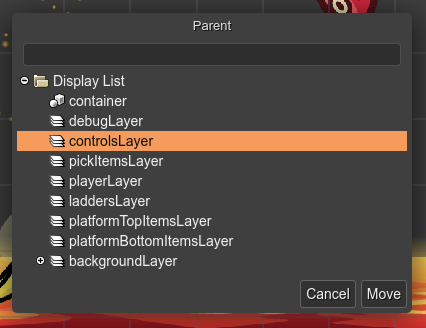
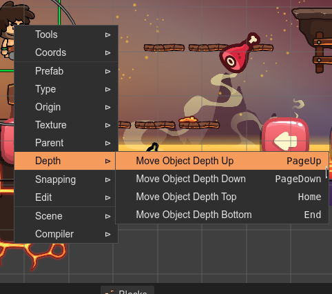

.. include:: ../_header.rst

Working with parent objects
---------------------------

In Phaser_, only two type of scene objects can be used as a "container" or a "parent" of other objects: the `Container <./container-object.html>`_, and the `Layer <./layer-object.html>`_ objects.

In the next section you can learn about operations common to both type of objects.

Parent context menu
~~~~~~~~~~~~~~~~~~~

The **Parent** sub-menu of the scene context menu shows the commands you can apply to containers and layers. Many of those commands are compatible with both types:

Moving an object to a parent
~~~~~~~~~~~~~~~~~~~~~~~~~~~~

You can move an object to a new parent. The command **Move To Parent** opens the **Parent** dialog. This dialog shows all the available parents for the object (including the `Display List <./display-list.html>`_) and you can select the new parent.

The command can be executed by pressing the ``Shift+P`` keys, selecting the **Move To Parent** option in the context menu, or pressing the **Parent button** in the `Parent section <parent-container-properties.html>`_ of the |InspectorView|_.

Breaking a parent
~~~~~~~~~~~~~~~~~

The **Break Parent** command removes a  Container or Layer, but keeps its children. The children are added to the parent of the parent, and their preserve the same absolute position.

You can execute the command by pressing the ``Shift+B`` keys or selecting the **Break Parent** option of the `Parent context menu`_.

Selecting the parent of an object
~~~~~~~~~~~~~~~~~~~~~~~~~~~~~~~~~

The **Select Parent** command selects the parent of an object. To execute the command press the ``P`` key or click on the **Select Parent** option of the `Parent context menu`_.

Changing the rendering order of children
~~~~~~~~~~~~~~~~~~~~~~~~~~~~~~~~~~~~~~~~

You can change the rendering order of an object. The context menu shows the **Depth** commands, to move the objects in different directions:

