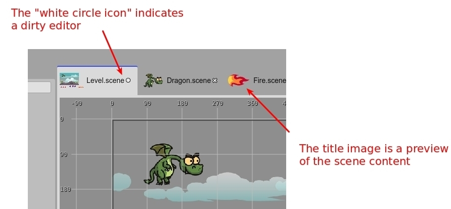

.. include:: _header.rst
   
.. sectnum::
   :depth: 3
   :start: 3

.. highlight:: javascript

Workbench
=========

The workbench is the sum of all the parts of the IDE: the editors, views, dialogs, menus, commands, themes, extensions, storage. Is the basement for the tools included in the IDE.

If you are a |PhaserEditor|_ v2 user, this new version of the IDE should result very familiar to you. It has a similar layout but removes all the complexity of a general purpose IDE, and shows to you only the tools you need.

.. image:: images/workbench-overview-04032020.jpg
 :alt: Workbench overview.

The IDE includes elements present in other game development tools:

* The `Outline view`_ shows the content of the active editor but with an hierarchical structure.

* The `Inspector view`_ shows the properties of the objects selected in the active editor or active view. We can say all objects you can edit in the IDE are modified in the `Inspector view`_.

* The `Blocks view`_ shows the elements you can use to build the objects of the active editor. If the active editor is the |SceneEditor|_, the `Blocks view`_ shows the assets you can drop into the scene. If the active editor is the |AssetPackEditor|_, then it shows the files you can import into the |AssetPackFile|_. Maybe this view is not so common in the market, but the concept is simple. 

* The `Files view`_ displays the files of the project. It is just like any other files explorer. It allows to delete, rename, move, upload the files. Open the files in an editor and other file related actions. Like the other views, when you select a file, the `Inspector view`_ shows the properties and other actions related to the file.

* The `Main toolbar`_ and `Main menu`_ provides commands (or actions) that affect the current editor or the whole IDE.

Views
~~~~~

A view is a panel that can be used with any purpose. In the IDE they are used mostly to display structured data or the properties of an object.

There are a couple of views in the IDE: some of them show content related to the active editor, content related to the selected element in the workbench, or content of the project.

At this moment, the views can be resized but not dragged, docked or stacked in other places in the workbench, or closed and opened (as you can do in other IDEs). We should add those features in a future version of IDE.

Editors
~~~~~~~

An editor is a panel that is dedicated to edit an object, or input. It has a title and a content area. The title shows the name or identifier of the input object and the content area provides the UI elements to edit the input. In the majority of the cases, the input of an editor is a file.

An important characteristic of the editors is the "dirty" state. When the user changes something in the editor, the editor is labeled as "dirty", and indicates that it should be saved to persist the changes. If you close an editor but it is dirty, it shows a confirmation message, because the changes will be lost.

Also, the title of an editor, in many cases, shows a preview of the content of the input. It is the case of scenes or images. This helps to identify the input of an editor when you have some of them open.

When open a project, the IDE opens the editors used in the previous session. This information is stored in the local storage of the browser. This means, it is not present in other browser instance or you can remove it by clearing the browser private data.

Files view
----------

The files...

Outline view
------------

The editor hierarchy...

Blocks view
-----------

The blocks of the editor...

Inspector view
--------------

The properties of selection...

Main toolbar
------------

Main menu
---------

Project templates
-----------------

Color themes
------------

Commands palette
----------------