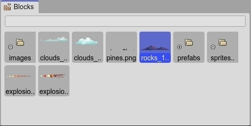

.. include:: ../_header.rst
   
.. highlight:: javascript

Blocks view
-----------

The |BlocksView|_ shows the building blocks of the current editor. This is a concept a bit different from other visual tools.

The common in other videogame creation tools is to provide an asset browser that displays all the assets present in the project.

The |BlocksView|_ displays only the assets, or "blocks", that can be used in a particular editor.

For example, in the |AssetPackEditor|_, the user adds files to the |AssetPackFile|_. These files are shown as blocks in the |BlocksView|_, but when a user adds a file to the editor, that file is hidden from the |BlocksView|_  because it is already present there.

The |InspectorView|_ shows the properties of the elements selected in the |BlocksView|_, or operations you can apply to them.

The |BlocksView|_ is a `content viewer <../misc/content-viewers.html>`_: it shows an inline preview of its elements, you can zoom in/out it and filter its content.

