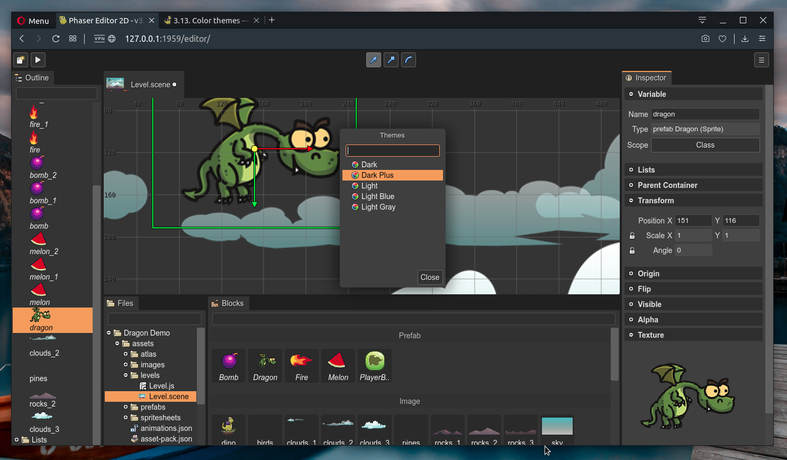

.. include:: ../_header.rst
   
.. highlight:: javascript

Color themes
------------

|PhaserEditor|_ supports a couple of light and dark color themes. You can select a color theme by pressing the ``Ctrl+2`` keys or selecting the **Select Color Theme** option in the |MainMenu|_.

The color themes are contributed by plugins. We should write how to create your own theme in a future Plugin Developer Guide.