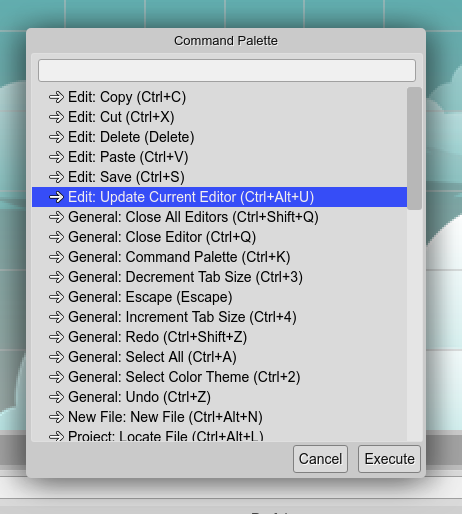

.. include:: ../_header.rst
   
.. highlight:: javascript

Command palette
---------------

The `Command palette`_ is a dialog that shows the commands available in the **current context**. You can open it by pressing ``Ctrl+K`` or clicking on the **Command Palette** option of the |MainMenu|_.

Not all commands are shown, those that do not apply to the **current context** (active view, active editor or active dialog) are omitted.

In the dialog, you can select a command and execute it by pressing the **Execute** button.



Commands are contributed to the workbench, by plugins.

Here a list of all the available commands, grouped by category:

.. csv-table::
 :header: "Category", "Command", "Keys", "Description"
 :widths: 1, 4, 1, 4

    "General","Decrement Tab Size","``Ctrl+3``","Make bigger the editor tabs."
    "General","Increment Tab Size","``Ctrl+4``","Make smaller the editor tabs."
    "General","Close Editor","``Ctrl+Q``","Close active editor."
    "General","Close All Editors","``Ctrl+Shift+Q``","Close all editors."
    "General","Undo","``Ctrl+Z``","Undo operation"
    "General","Redo","``Ctrl+Shift+Z``","Redo operation"
    "General","Collapse All","``C``","Collapse all elements"
    "General","Select All","``Ctrl+A``","Select all elements"
    "General","Expand/Collapse the tree branch","``Space``","Expand or collapse a branch of the select element"
    "General","Escape","``Escape``","Escape"
    "General","Command Palette","``Ctrl+K``","Show a dialog with the list of commands active in that context."
    "General","Select Color Theme","``Ctrl+2``","Select the color theme of the IDE."
    "Edit","Save","``Ctrl+S``","Save"
    "Edit","Delete","``Delete``","Delete"
    "Edit","Rename","``F2``","Rename"
    "Edit","Copy","``Ctrl+C``","Copy selected objects."
    "Edit","Cut","``Ctrl+X``","Cut selected objects."
    "Edit","Paste","``Ctrl+V``","Paste clipboard content."
    "Edit","Update Current Editor","``Ctrl+Alt+U``","Refresh the current editor's content."
    "New File","New File","``Ctrl+Alt+N``","Create new content."
    "Project","Open Project","``Ctrl+Alt+P``","Open other project or create a new one."
    "Project","Play Project","``F12``","Run this project in another tab"
    "Project","Quick Play Project","``F10``","Run this project in a dialog."
    "Project","Reload Project","``Ctrl+Alt+R``","Reload the project files."
    "Project","Locate File","``Ctrl+Alt+L``","Open the selected file (or project root) in the OS file manager."
    "Scene Editor","Create Container With Selection","``J``","Create a container with the selected objects"
    "Scene Editor","Trim Container","``Shift+T``","Remove left/top margin of children."
    "Scene Editor","Break Container","``Shift+B``","Destroy container and re-parent children."
    "Scene Editor","Select Parent","``P``","Select the parent container"
    "Scene Editor","Move To Parent","````","Re-parent the selected objects."
    "Scene Editor","Open Output File","````","Open the output source file of the scene."
    "Scene Editor","Compile Scene","````","Compile the editor's Scene."
    "Scene Editor","Compile Scenes","``Ctrl+Alt+B``","Compile all the Scene files of the project."
    "Scene Editor","Translate Tool","``T``","Translate the selected scene objects"
    "Scene Editor","Rotate Tool","``R``","Rotate the selected scene objects"
    "Scene Editor","Scale Tool","``S``","Scale the selected scene objects"
    "Scene Editor","Resize TileSprite Tool","``Z``","Resize selected TileSprite objects."
    "Scene Editor","Set Origin To Top/Left","``Shift+1``","Set the origin of the object to (0,1)"
    "Scene Editor","Set Origin To Top/Center","``Shift+2``","Set the origin of the object to (0.5,1)"
    "Scene Editor","Set Origin To Top/Right","``Shift+3``","Set the origin of the object to (1,1)"
    "Scene Editor","Set Origin To Middle/Left","``Shift+4``","Set the origin of the object to (0,0.5)"
    "Scene Editor","Set Origin To Middle/Center","``Shift+5``","Set the origin of the object to (0.5,0.5)"
    "Scene Editor","Set Origin To Middle/Right","``Shift+6``","Set the origin of the object to (1,0.5)"
    "Scene Editor","Set Origin To Bottom/Left","``Shift+7``","Set the origin of the object to (0,0)"
    "Scene Editor","Set Origin To Bottom/Center","``Shift+8``","Set the origin of the object to (0.5,0)"
    "Scene Editor","Set Origin To Bottom/Right","``Shift+9``","Set the origin of the object to (1,0)"
    "Scene Editor","Move Object Up","``PageUp``","Move the object in its container to Up."
    "Scene Editor","Move Object Down","``PageDown``","Move the object in its container to Down."
    "Scene Editor","Move Object Top","``Home``","Move the object in its container to Top."
    "Scene Editor","Move Object Bottom","``End``","Move the object in its container to Bottom."
    "Scene Editor","Replace Type","````","Replace the type of the selected objects."
    "Scene Editor","Convert To TileSprite","``L``","Convert the selected objects into TileSprite instances. Or resize it if it is a TileSprite."
    "Scene Editor","Open Prefab","``F``","Open the Prefab file of the selected prefab instance."
    "Scene Editor","Add Object","``A``","Add a new object to the scene"
    "Scene Editor","Select All With Same Texture","````","Select all the objects with the same texture."
    "Scene Editor","Replace Texture","``X``","Change the texture of the selected objects."
    "Scene Editor","Toggle Snapping","``E``","Enable/disable the snapping."
    "Scene Editor","Snap To Object Size","``W``","Enable snapping and set the size to the selected object."

