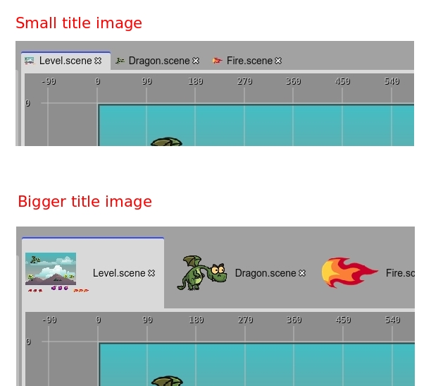

.. include:: ../_header.rst
   
.. highlight:: javascript

Editors
-------

An editor is a panel that is dedicated to edit an object, or input. It has a title and a content area. The title shows the name or identifier of the input object and the content area provides the UI elements to edit the input. In the majority of the cases, the input of an editor is a file.

Dirty state
~~~~~~~~~~~

An important characteristic of the editors is the "dirty" state. When the user changes something in the editor, the editor is labeled as "dirty", and indicates that it should be saved to persist the changes. If you close an editor but it is dirty, it shows a confirmation message, because the changes will be lost.

.. image:: ../images/workbench-editor-dirty-04042020.jpg
 :alt: Editor dirty state and content preview.

Title image
~~~~~~~~~~~

The title of an editor, in many cases, shows a preview of the content of the input. It is the case of scenes or images. This helps to identify the input of an editor when you have some of them open.

You can make the title image bigger or smaller, by pressing ``Ctrl+3`` and ``Ctrl+4``.

Title menu
~~~~~~~~~~

The editor's title provides a context menu with a couple of options. To close the editor, close other editors or change the title's image size:

.. image:: ../images/workbench-editor-title-menu-04052020.jpg
 :alt: The context menu of the editor's title.

Restore editors
~~~~~~~~~~~~~~~

When you open a project, the IDE opens the editors used in the previous session. This information is stored in the local storage of the browser. This means, it is not present in other browser instance or you can remove it by clearing the browser private data.