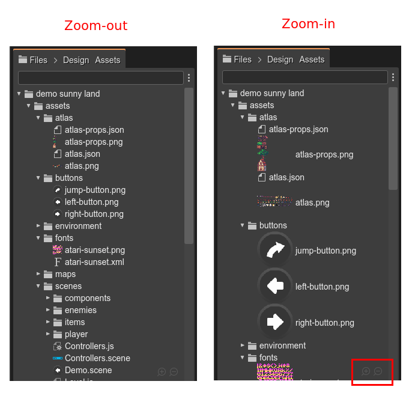
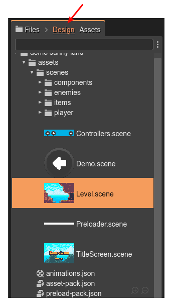
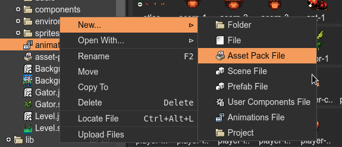
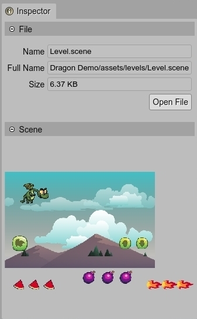

.. include:: ../_header.rst

Files view
----------

The |FilesView|_ shows the files of the project. The files are displayed in a tree structure, like in many other file navigators. 

Like the other `content viewers <../misc/content-viewers.html>`_ present in the IDE, the |FilesView| shows inline previews of a certain type of files. At the same time, you can zoom in/out them by pressing the ``Shift`` key and rolling the mouse wheel.

The Design and Assets sub-tabs
~~~~~~~~~~~~~~~~~~~~~~~~~~~~~~

The main activities you do with Phaser Editor 2D are to create the scenes and pack the assets. For this reason, we added two sub-tabs to the Files view: **Design** and **Assets**. It allows you (we hope) to filter the files and show in the view only the files related to a certain activity.

When you select the **Design** tab, the view shows only the files you commonly edit with Phaser Editor 2D: the Scene files, the User Components files, the Animations files, the Asset Pack files.

When you select the **Assets** tab, the view shows only the files used as assets by the different editor: images, atlas files, audio files, video files, Asset Pack files, etc...

In both cases, empty folders are not shown. And all files are shown if no sub-tab is selected.

There is another usual activity in the editor: coding. JavaScript and TypeScript files are excluded in both filters. We think coding is not the strong point in the editor and we encourage you to use |VSCode|_ if possible. In any case, you always have the option of showing all files.

Context menu
~~~~~~~~~~~~

The context menu lists a couple of common file operations.

The **New...** sub-menu shows shortcuts to create new files related to the IDE tools.

The **Open With** sub-menu shows all the editors you can use to open a selected file.

There **Rename**, **Move**, **Copy To** and **Delete** options work just like in any other file manager. But warning, at this moment, these operations cannot be undone, so take care of them.

If you run the server locally (not using the ``-public`` option), then the context menu shows the **Locate File** item. It opens the default file manager of your OS at the location of the selected file or folder.

The **Upload Files** option opens the `Upload dialog <upload-dialog.html>`_. The files will be uploaded to the selected folder (or parent folder if the selected item is a file).

Inspector view integration
~~~~~~~~~~~~~~~~~~~~~~~~~~

The |InspectorView|_ shows the properties of the objects selected in the active view or part. When you select a file in the |FilesView|_, the |InspectorView|_ displays different property sections of the file.

In all cases, the |InspectorView|_ shows the **File** section. It displays the **Name**, **Full Name**, **Size**, and a button to open the file in an editor.

In addition, plugins can provide their own file property sections for |InspectorView|_. There are the cases of the images preview, the scenes preview or the `Asset Pack Editor section <../asset-pack-editor/import-from-files-view.html>`_.

