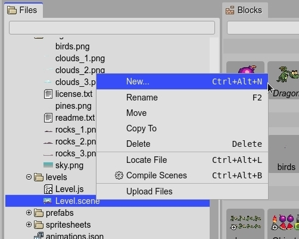

.. include:: ../_header.rst

Files view
----------

The |FilesView|_ shows the files of the project. The files are displayed in a tree structure, like in many other file navigators. 

Like the other `content viewers <../misc/content-viewers.html>`_ present in the IDE, the |FilesView| shows inline previews of certain type of files. At the same time, you can zoom in/out them by pressing the ``Shift`` key and rolling the mouse wheel.

.. image:: ../images/files-view-zoom-04052020.jpg
 :alt: Files view zooming.

Context menu
~~~~~~~~~~~~

The context menu lists a couple of common file operations.

The **New** option opens the `New File dialog <new-file-dialog.html>`_. A dialog that allows to create new files related to the IDE tools, and new projects.

There are options **Rename**, **Move**, **Copy To** and **Delete** work just like in any other file manager. But warning, at this moment, these operations cannot be un-done, so take care with them.

If you run the server with the ``-desktop`` option, then the context menu shows the **Locate File** item. It opens the default file manager of your OS at the location of the selected file or folder.

The context menu can be extended by plugins. It is the case of the |SceneEditor|_ plugin, that inserts the **Compile Scenes** option in the menu. If you click it, the selected scene files will be compiled.

The **Upload Files** option opens the `Upload dialog <upload-dialog.html>`_. The files will be uploaded to the selected folder (or parent folder if the selected item is a file).

Inspector view integration
~~~~~~~~~~~~~~~~~~~~~~~~~~

The |InspectorView|_ shows the properties of the objects selected in the active view or part. When you select a file in the |FilesView|_, the |InspectorView|_ displays different property sections of the file.

In all cases, the |InspectorView|_ shows the **File** section. It displays the **Name**, **Full Name**, **Size**, and a button to open the file in an editor.

In addition, plugins can provide their own file property sections for |InspectorView|_. There are the cases of the images preview, the scenes preview or the `Asset Pack Editor section <../asset-pack-editor/import-from-files-view.html>`_.

.. image:: ../images/files-view-inspector-1-04052020.jpg
 :alt: Inspector view shows the selected file properties.

