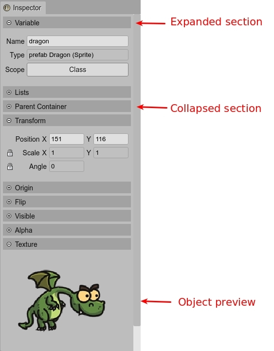

.. include:: ../_header.rst
   
.. highlight:: javascript

Inspector view
--------------

The |InspectorView|_ shows the properties of the objects selected in the active view or editor.

The properties are grouped into sections. The sections can be collapsed/expanded.

In addition to common properties, a section can display preview images or buttons to apply certain operations to the selected objects.

