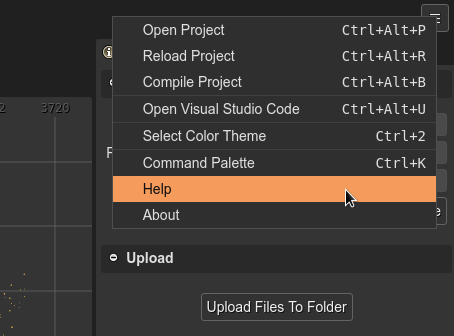

.. include:: ../_header.rst

Main menu
---------

The |MainMenu|_ lists common general commands. You can open it by pressing in the menu button at the right of the |MainToolbar|_:

* **Open Project**: launches the `Open Project dialog <projects.html#projects-dialog>`_.

* **Reload Project**: `reloads the project files <projects.html#reload-project>`_.

* **Compile Project**: compiles all compilable files of the project. For example, the `scene <../scene-editor/scene-compiler.html>`_ and `component <../scene-editor/user-components-compiler.html>`_ files. This does not include TypeScript files or any other format with external compilers.

* **Open Visual Studio Code**: opens the project in a local |VSCode|_ instance. This is available only if the |PhaserEditor|_ server is running in `desktop mode <../misc/server-options.html>`_.

* **Select Color Theme**: opens the `Color Themes dialog <color-themes.html>`_.

* **Command Palette**: opens the `Command Palette <command-palette.html>`_

* **Help**: opens this documentation in the browser.

* **About**: opens the About dialog.