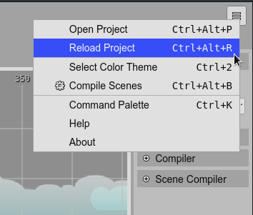

.. include:: ../_header.rst
   

Main menu
---------

The |MainMenu|_ lists common general commands. You can open it by pressing in the menu button at the right of the |MainToolbar|_:

* **Open Project**: launches the `Open Project dialog <projects.html#open-project-dialog>`_.

* **Reload Project**: 