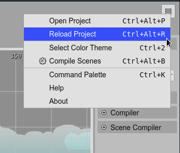

.. include:: ../_header.rst

Main menu
---------

The |MainMenu|_ lists common general commands. You can open it by pressing in the menu button at the right of the |MainToolbar|_:

* **Open Project**: launches the `Open Project dialog <projects.html#projects-dialog>`_.

* **Reload Project**: `reloads the project files <projects.html#reload-project>`_.

* **Select Color Theme**: opens the `Color Themes dialog <color-themes.html>`_.

* **Compile Scenes**: compiles all the |SceneEditor|_ files of the project.

* **Command Palette**: opens the `Command Palette <command-palette.html>`_

* **Help**: opens this documentation in the browser.

* **About**: opens the About dialog.