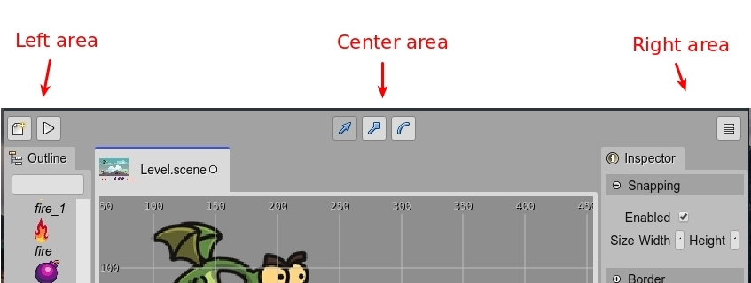

.. include:: ../_header.rst
   
.. highlight:: javascript

Main toolbar
------------

The |MainToolbar| is placed at the top of the window. The toolbar is divided into three areas: left, center and right.

In the left area there are buttons to trigger global commands: 

* Open the `New File dialog <new-file-dialog.html>`_.
* `Execute the project <playing-project.html>`_.

The center area is dynamic. Its content is contributed by the active editor. This means, the buttons shown there fire commands that only affect the active editor. For example, the |SceneEditor|_ contributes the transformation commands to the center area of the toolbar. If the editor is closed, the buttons are removed.

The right area shows a button to open the |MainMenu|_.

