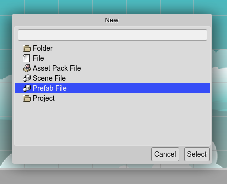
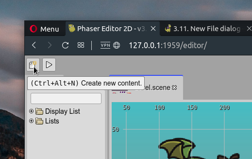

.. include:: ../_header.rst

New File dialog
---------------

The `New File dialog`_ shows the different types of files you can create. When you select a type of file, it launches a dedicated dialog to create the file. These specific file dialogs are contributed by the different plugins.

Well, not only files. You can create a new folder or a `new project <projects.html#new-project-dialog>`_.

To open the `New File dialog`_ you can click on the **New File** button of the |MainToolbar|_ or press the ``Ctrl+Alt+N`` keys.

