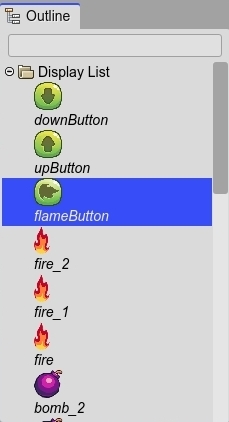

.. include:: ../_header.rst
   
.. highlight:: javascript

Outline view
------------

The purpose of the  |OutlineView|_ is to show the content of the active editor but with a hierarchical structure.

An editor contributes to the |OutlineView|_ with content but also with a context menu and |InspectorView|_ support.

Like the other `content viewers <../misc/content-viewers.html>`_, it shows inline preview of the items, and can be zoomed in/out, and the content can be filtered.

