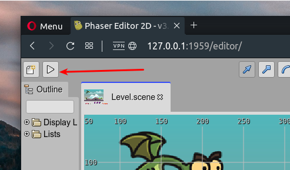
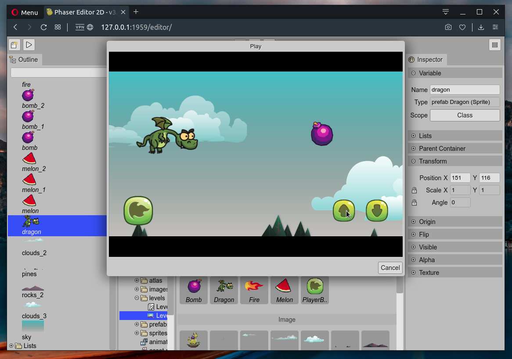

.. include:: ../_header.rst

Playing the project
===================

You can run the project in another browser tab or as a frame inside the IDE.

To run the project in another browser tab, you can press ``F12`` or click on the **Play** button of the |MainToolbar|_.

To run the project in a frame inside the IDE press the ``F10`` key.

When you play the project, it saves all editors automatically.

