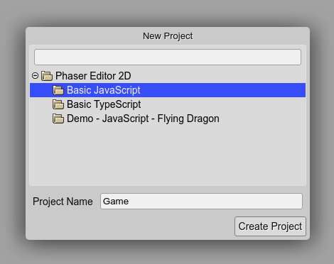
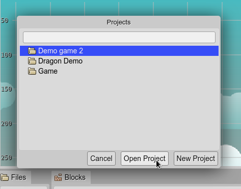

.. include:: ../_header.rst

Projects
========

A |PhaserEditor|_ project is just a folder. It contains the files of your game and is the root of the web path of the game. This means, that you should place the ``index.html`` file in the root of the folder.

The projects are created inside the workspace. The workspace can be any folder. By default, the IDE creates a workspace folder in your home directory, with the ``PhaserEditor2D_Projects`` name.

You can change the location of the workspace when you start the server:

.. highlight:: bash

.. code::

    $ PhaserEditor2D -desktop -ws "path/to/my/workspace"

`Learn more about the server options <../misc/server-options.html>`_

New Project dialog
------------------

When you open the IDE in an empty workspace, it first shows the `New Project dialog`_.

This dialog displays the project templates available in your installation. You must select a template, write a new name for the project, and create the project.

You can open this dialog at any time:

1. Open the `New File dialog <new-file-dialog.html>`_ (press the keys ``Ctrl+Alt+N`` or click the **New File** button in the |MainToolbar|_).
2. Select **Project**.
 .. image:: ../images/workbench-new-file-select-project-04072020.png
  :alt: Open New Project dialog from the New File dialog.

Projects dialog
---------------

When you open the IDE, if the workspace is not empty, it shows the `Projects dialog`_. Also, you can open it at any time:

* Pressing the ``Ctrl+Alt+P`` keys.
* Or clicking on the **Open Project** option of the |MainMenu|_.

The dialog displays all the projects in the workspace, you can select one and open it.

Note the dialog also shows a **New Project** button, it opens the `New Project dialog`_.

When a project is opened, the IDE restores the last state of the project. This state contains the open editors and the state of each editor.

This information is stored in the browser local storage so you can delete it at any time.

Project templates
-----------------

The `New Project dialog`_ displays the project templates. These are just projects that the user copies into its workspace with a new name.

You can find these project templates in the ``PhaserEditor2D/templates`` folder of your IDE installation.

This folder contains the ``include`` folder and the ``providers`` folder.

The ``templates/include`` folder contains files that are copied to all the new projects. It contains the Phaser_ runtime files and the Phaser_ TypeScript type definitions. You can add your files there if you wish to include them in all the new projects.

The ``templates/providers`` folder contains the project templates grouped by its provider folder. You can create a new provider folder, let's say ``templates/MyTemplates`` and copy there all the projects you wish to include in the `New Project dialog`_. Remember, you don't need to include the Phaser_ runtime in the project templates, it is included in the ``templates/include`` folder.

.. code::

  PhaserEditor2D/ # installation folder
    templates/    
      include/ # the content is copied to all projects
        lib/
          ...
        types/
          ...
      providers/
        PhaserEditor2D/ # the Phaser Editor 2D templates
          Basic JavaScript/ # template 1
            ...
          Basic TypeScript/ # template 2
            ...
          Demo - JavaScript - Flying Dragon/ # template 3
            ...
        MyTemplates/ # your own templates)
          MyGame1/ # your template 1
            ...
          MyGame2/ # your template 2
            ...

Important: in the project template folder you should create a ``template.json`` file. This file contains information on the template. For now, this information only includes the files should be open when the project is created. For example, let's say your template has a ``Level.scene`` file that you want to open each time you create a project. You can create a ``template.json`` file like this:

.. highlihgt:: json

.. code::

  {
    "openFiles": [
      "scenes/Level.scene"
    ]
  }

Reload project
--------------

|PhaserEditor|_ is not created with collaborative editing in mind. This means, that it assumes that only one user is working on the same project at the same time. You can use source control managers like ``Git``to collaborate with your team.

However, it may be possible that you change the project files with external tools and you need to refresh that changes in the IDE. When the IDE gets the focus, it does an incremental reload of the changes made by external tools, but you can force (and we recommend) a full reload of the project:

* Pressing ``Ctrl+Alt+R``.
* Or clicking on the **Reload Project** option of the |MainMenu|_.
 
A full reload of the project also may help to fix a glitch with the |SceneEditor|_ or any other editor.

A reload of the project is different from a reload of the whole web page because only the files of the project are requested again. But a full web page reload is a good procedure if you see your IDE is consuming a lot of memory resources.

You can read the `Resources caching <../misc/resources-caching.html>`_ section for additional information.