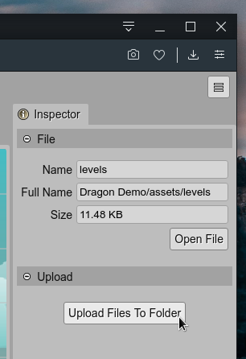

.. include:: ../_header.rst

Upload dialog
-------------

The `Upload dialog`_ allows adding local files to your project.

In the `Files view <files-view.html>`_, right-click on a folder or file and select the **Upload Files** option. It opens the `Upload dialog`_.

Click on the **Browse** button to select the files in your PC and press the **Upload** button to add them to the project. The new files are added under the selected folder in the `Files view`_, or the parent folder is the selection is a file.

.. image:: ../images/workbench-upload-dialog-04072020.png
 :alt: Upload dialog

If you select a folder in the `Files view`_, you can launch the dialog the section **Upload** of the |InspactorView|_.

Sure, if the IDE server is running locally, you can add files to the project folder using the OS file manager. In that case, we recommend to `reload the project files <projects.html#reload-project>`_ in the IDE.

